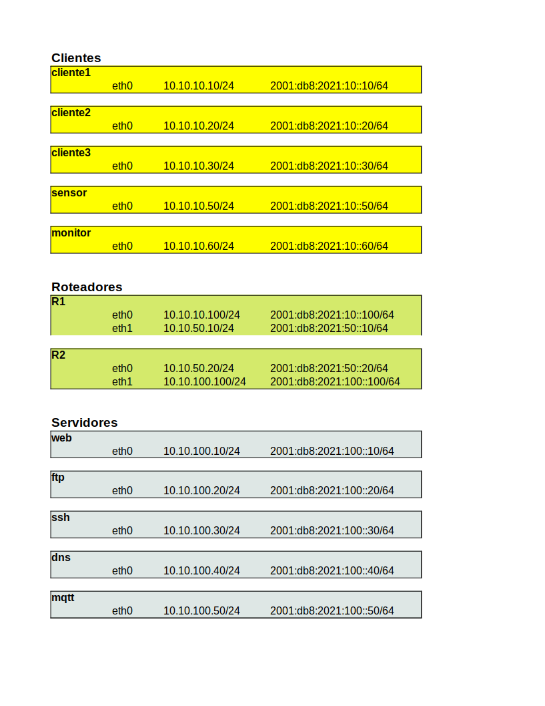

# Laboratório de redes usando docker

Topologia mais elaborada, com 3 containers cliente, 2 roteadores e 3 servidores (1 servidor web (nginx), 1 servidor ftp e 1 servidor ssh)

## Diagrama da rede

## Plano de endereçamento

## Clientes
* cliente1, cliente2 e cliente3
* utilizam a imagem debian-cliente (debian buster com alguns pacotes como traceroute, tcpdump, netcat, curl, links, nmap, ftp)

## Roteadores
* R1 e R2
* utilizam a imagem alpine-roteador (alpne com alguns pacotes tais como frr)
* Utilizado o software frr (https://frrouting.org/)
  * utilizando rip e ripng (bem simples)
  * Arquivo de configuracao: /etc/frr/frr.conf
  * Comando de linha para configuração: vtysh
  * documentação para usuário: http://docs.frrouting.org/en/latest/

## Servidores
* web (nginx), ftp e ssh.
* para o ssh, temos usuario inf500 com senha inf500
* o ftp aceita login anonimo (usuario ftp sem senha)