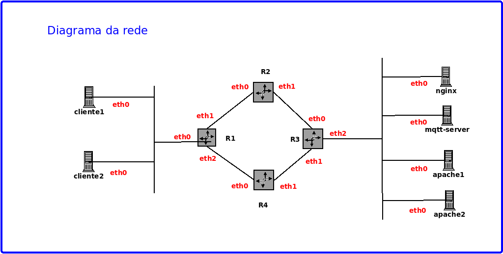
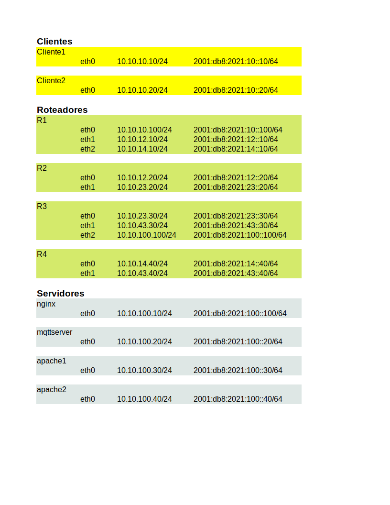

# Laboratório de redes usando docker

Topologia mais elaborada, com dois containers cliente, 4 roteadores e 4 servidores (1 nginx, 2 apache 
e 1 mosquitto);

## Diagrama da rede

## Plano de endereçamento

## Clientes
* cliente1 e cliente2
* utilizam a imagem debian-cliente (debian buster com alguns pacotes como traceroute, tcpdump, netcat, c
url, links, nmap, ftp)
## Roteadores
* R1, R2, R3 e R4
* utilizam a imagem alpine-roteador (alpne com alguns pacotes tais como frr)
* Utilizado o software frr (https://frrouting.org/)
  * utilizando rip e ripng (bem simples)
  * Arquivo de configuracao: /etc/frr/frr.conf
  * Comando de linha para configuração: vtysh
  * documentação para usuário: http://docs.frrouting.org/en/latest/
## Servidores
* nginx, ssh, ftp  e mqtt (mosquitto server)
